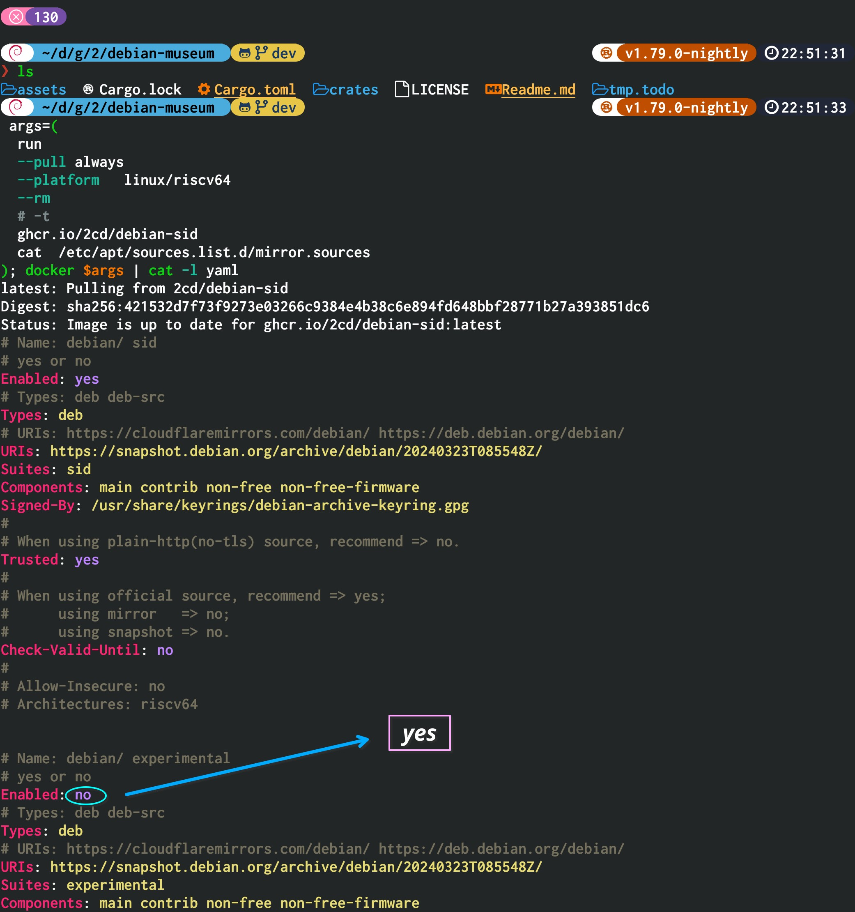
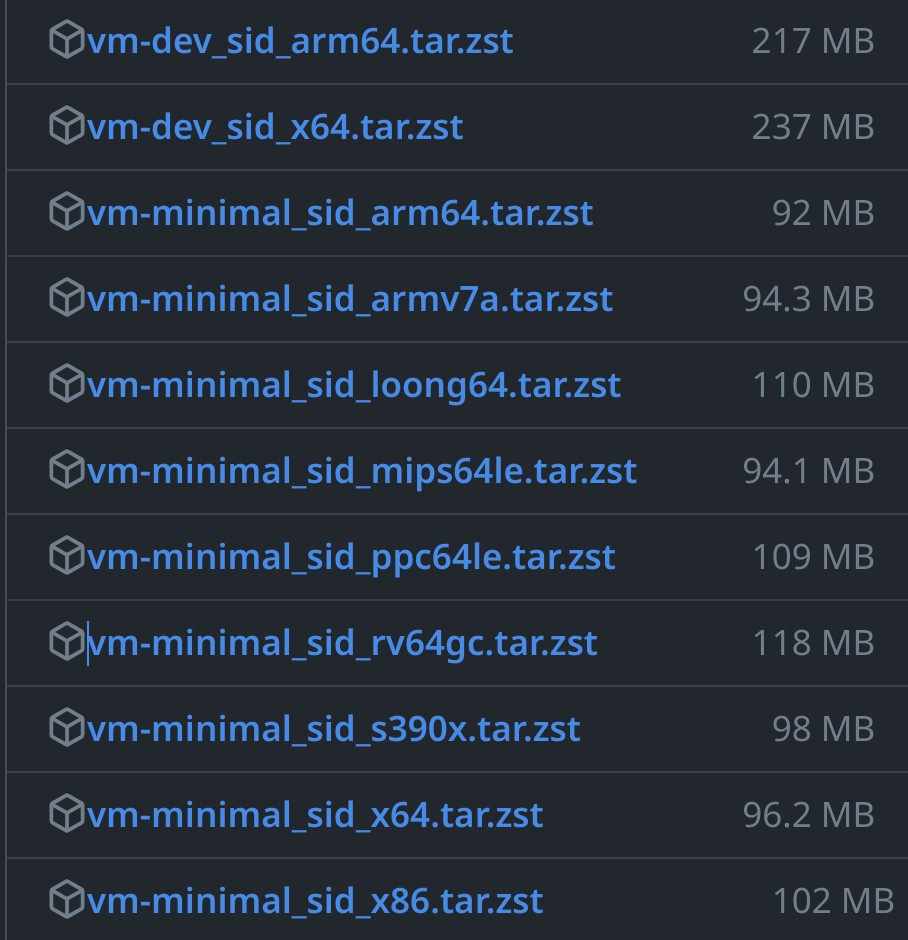

# Debian Museum


- [Releases](https://github.com/2cd/debian-museum/releases)
- [Containers](https://github.com/2cd/debian-museum/pkgs/container/debian)

## History

| version     | release           |
| ----------- | ----------------- |
| 0.01 ~ 0.90 | 1993-08 ~ 1993-12 |
| 0.91        | 1994-01           |
| 0.93R5      | 1995-03           |
| 0.93R6      | 1995-10-26        |

---

| version | codename | created    | release    | eol        |
| ------- | -------- | ---------- | ---------- | ---------- |
| 1.1     | Buzz     | 1993-08-16 | 1996-06-17 | 1997-06-05 |
| 1.2     | Rex      | 1996-06-17 | 1996-12-12 | 1998-06-05 |
| 1.3     | Bo       | 1996-12-12 | 1997-06-05 | 1999-03-09 |
| 2.0     | Hamm     | 1997-06-05 | 1998-07-24 | 2000-03-09 |
| 2.1     | Slink    | 1998-07-24 | 1999-03-09 | 2000-10-30 |
| 2.2     | Potato   | 1999-03-09 | 2000-08-15 | 2003-06-30 |
| 3.0     | Woody    | 2000-08-15 | 2002-07-19 | 2006-06-30 |
| 3.1     | Sarge    | 2002-07-19 | 2005-06-06 | 2008-03-31 |
| 4.0     | Etch     | 2005-06-06 | 2007-04-08 | 2010-02-15 |
| 5.0     | Lenny    | 2007-04-08 | 2009-02-14 | 2012-02-06 |

---

| version | codename | created    | release    | eol        | eol-lts    | eol-elts   |
| ------- | -------- | ---------- | ---------- | ---------- | ---------- | ---------- |
| 6.0     | Squeeze  | 2009-02-14 | 2011-02-06 | 2014-05-31 | 2016-02-29 |            |
| 7       | Wheezy   | 2011-02-06 | 2013-05-04 | 2016-04-25 | 2018-05-31 | 2020-06-30 |
| 8       | Jessie   | 2013-05-04 | 2015-04-26 | 2018-06-17 | 2020-06-30 | 2025-06-30 |
| 9       | Stretch  | 2015-04-26 | 2017-06-17 | 2020-07-18 | 2022-06-30 | 2027-06-30 |
| 10      | Buster   | 2017-06-17 | 2019-07-06 | 2022-09-10 | 2024-06-30 | 2029-06-30 |
| 11      | Bullseye | 2019-07-06 | 2021-08-14 | 2024-08-14 | 2026-08-31 | 2031-06-30 |
| 12      | Bookworm | 2021-08-14 | 2023-06-10 | 2026-06-10 | 2028-06-30 | 2033-06-30 |

---

| version | codename | created    | release |
| ------- | -------- | ---------- | ------- |
| 13      | Trixie   | 2023-06-10 | 2025?   |
| 14      | Forky    | 2025-08?   | 2027?   |

---

| version      | codename |
| ------------ | -------- |
| unstable     | Sid      |
| experimental | RC-Buggy |

> Unlike the Debian Releases unstable and testing, [experimental](https://wiki.debian.org/DebianExperimental) isn't a complete distribution, it can work only as an extension of unstable.
>

To enable experimental source, run a sid container and then edit the **/etc/apt/sources.list.d/mirror.sources** file in the container.



---

> See also:
>
> - [Ubuntu Museum](https://github.com/2cd/ubuntu-museum/)
> - [Debian Project History](https://www.debian.org/doc/manuals/project-history/releases.en.html)
> - [distro-info-data/debian.csv](https://debian.pages.debian.net/distro-info-data/debian.csv)
> - [Wiki/DebianTesting](https://wiki.debian.org/DebianTesting)

## Virtual Machine

Unlike containers, virtual machine images only support a few newer versions such as **jessie**, **stretch**, **buster**, **bullseye**, **bookworm**, and **sid**.

The primary reason for this is that testing different architectures and versions of virtual machine images is quite exhausting!

> Container images even support versions from the last century.

Please feel free to send an issue to tell us which version you are using and which architecture.

> DO NOT use PROFANITY or DISCRIMINATORY language in issues!

We're going to probably increase support for the version and the architecture.

Although this isn't the best virtual machine project, nor the most comprehensive, for me, it's the best **nogui** virtual machine project!

Why not give it a try? You can experience virtual machines for **riscv64gc**, **loongarch64**, **mipsle**, **s390x**, and other architectures in just a few minutes.

### Step0: download the vm image

> These VM images are built automatically by [github actions](https://github.com/2cd/debian-museum/actions/workflows/vm-minimal.yml).



Go to the **Releases** section and download file that start with **vm-**.

> Files starting with version numbers are container images (e.g., **8_jessie_**), not virtual machine images.

Now let's take **bookworm x64 (x86_64)** as an example.

```sh
mkdir -p vm/12/x64
cd vm/12

url='https://github.com/2cd/debian-museum/releases/download/12/vm-minimal_bookworm_x64.tar.zst'
# If you don't have aria2 installed, then curl will be used.
aria2c -s5 -x5 "$url" || curl -LO "$url"

cd x64
tar -xvf ../vm-minimal_bookworm_x64.tar.zst
```

### Step1: install qemu

Unlike other software, where older versions are installed to maintain stability, for **qemu**, it is recommended to install a newer version (such as 8.2+) instead of the old one.

Alpine

```sh
# If the VM is x64 arch:
apk add qemu-system-x86_64

# If the VM is arm64 arch:
apk add qemu-system-aarch64

# If the VM is rv64 arch:
apk add qemu-system-riscv64

# If the VM is loong64 arch:
apk add qemu-system-loongarch64
```

Android Termux

```sh
# If the VM is x64 arch:
pkg i qemu-system-x86-64-headless

# If the VM is arm64 arch:
pkg i qemu-system-aarch64-headless
```

ArchLinux

```sh
# If the VM is x64 arch:
paru -Sy qemu-system-x86

# If the VM is arm64 arch:
paru -S qemu-system-aarch64
```

Debian, Ubuntu, Kali, Mint, ...

```sh
# run apt as root (e.g., sudo-rs apt update)
apt update
apt install qemu-system
```

There are other distributions that we haven’t listed one by one. For example, on Fedora, the package name for x64 QEMU is qemu-system-x86. You can use the package manager that comes with your distribution to search for qemu-system and then install the corresponding architecture’s QEMU.

Feel free to explore and set up QEMU based on your distribution!

### Step2: fix KVM permissions (Optional)

> Please note: Linux Kernel 5.7+ no longer supports arm32 KVM. If you’re using an armv7l device, you can skip this part.
>
> See also [phoronix/Linux-5.7-Kill-32-bit-ARM-KVM](https://www.phoronix.com/news/Linux-5.7-Kill-32-bit-ARM-KVM)

Unfortunately, if your system kernel and CPU don’t support KVM or other acceleration schemes (e.g., xen), virtual machine performance will be quite slow. Some people humorously say that QEMU isn’t **Quick** at all; it’s more like **Slow EMU.** However, this is a misconception.

For instance:

On devices that support x64 KVM, using a Debian Sid x64 minimal virtual machine, the boot time is only around 4 seconds.
But the same image on Android arm64 takes over a minute to boot.
Nevertheless, this is already quite fast and comparable to Alpine Linux.

> I’ve experienced running **Windows arm64** on a device **without** arm64 KVM support, and it is not an exaggeration to say that you need to wait for hours.

---

Add the current user to the kvm user group.

```sh
# run it as root (i.e., +sudo/+sudo-rs/+doas)
usermod -aG kvm "$(id -un)"
```

If it does not work, change he permissions manually.

```sh
# run it as root
chmod 666 -v /dev/shm
```

### Step3: install zsh

On most distributions, the package name for zsh is `zsh`, and you can install it using your system's package manager.
e.g., `apt install zsh`

For Linux systems other than Android and embedded distributions, you can also download it from the [2moe/zsh-static-docker](https://github.com/2moe/zsh-static-docker/releases) repository. (Extract tar.zst and get `opt/bin/zsh`, finally move it to `${XDG_BIN_HOME:~/.local/bin}`)

> It can also be another "**PATH**", not necessarily `XDG_BIN_HOME`.

### Step4: expand virtual disk (Optional)

Install `qemu-utils`, then run `qemu-img`.

> If you have enough disk space then `+2G` can be changed to `+10G`

```sh
qemu-img resize disk.img +2G
```

If `unsafe-resize-disk.service` (systemd) works correctly, it will automatically resize the partitions to utilize the unallocated space.

> This service does not support jessie (2015), only stretch (2017) and newer. If you must use it on jessie, you need to manually replace `parted` and `sfdisk` with newer versions.
>
> The disk partition table is automatically backed up to **/var/lib/tmm/bak/sfdisk/** before resizing.

### Step5: run

This is a Zsh script that **doesn’t** require root permissions and **won’t** automatically create files outside of `$PWD` or `${0:a:h}` (i.e., `current_exe()?.parent()`) directories.

> It’s a bit complex, and in the future, it might be combined with WASI (WebAssembly System Interface) to handle the core logic.

```sh
./run
```

> localhost login: root

### Step6: SSH (Optional)

install OpenSSH client

> The ssh package name for debian/ubuntu is `ssh`, or `openssh` in some distributions.

If you don't need sshd, install the ssh client separately.

Open a new terminal session/window, then run:

```sh
# run apt as root (i.e., +sudo/+sudo-rs/+doas)
apt install openssh-client
```

> Run it on your host, not VM.

Then check the `./connect-to-ssh` script.

SSH is a very important thing. Before running related scripts, you have to make sure there is no malicious code inside!

No matter what, you need to be cautious about this.

```sh
cat connect-to-ssh
```

Finally, connect to SSH.

```sh
./connect-to-ssh
```

## Docker

The following content is prepared for Docker users.

If you want to experience Docker on devices that do not support the Docker kernel, you can use **vm-dev_bookworm_x64.tar.zst** or **vm-dev_bookworm_arm64.tar.zst**.

The Dev VM comes pre-installed with Docker, qemu-user-static, and systemd-nspawn.

---

- RUN IT ON zsh.
  - bash is NOT SUPPORTED, NOR is dash
- Just change the values of `ver` & `arch`
- What follows may seem complicated, but it's actually quite simple to follow step-by-step.
- Depends:
  - `docker.io` | `docker-ce` | `docker-ee`
  - `zsh` (>= 5)
- Recommends:
  - [qemu-user-static](https://tracker.debian.org/pkg/qemu) | [qemu-user-static-binfmt](https://archlinux.org/packages/extra/x86_64/qemu-user-static-binfmt/)

```zsh
setopt interactive_comments

# On modern Linux distro, running very very old debian containers can be problematic! (e.g., host: 12(bookworm, kernel: 6.x), container: 3.1(sarge), host-arch: amd64, container-arch: amd64)
#
# versions: 8, 9, 10, 11, 12, 13, sid
ver=sid

# architectures: "", "riscv64", "rv64", "amd64", "x86_64", "x64", "arm64", "aarch64", "i386", "loong64", "armhf"
# The architectures supported by different versions are not exactly the same.
# For example, trixie(13) no longer supports mipsle (a.k.a., MIPS 32-bit Little Endian),
# sid(unstable) supports more architectures than stable.
arch=""

# --------------------------
dbg() {
    print >&2 -Pr "%F{blue}[DEBUG]%f $*"
}
# if ver.is_empty()
if ((! $#ver)) {
    ver=sid
}

# Debian sid supports a very large number of architectures, not all of which are listed here.
rv64=riscv64
x86=386
x64=amd64
aa64=arm64
local -A oci_arch_map=(
    # riscv64imafdc
    rv64gc       $rv64
    riscv64      $rv64
    rv64         $rv64
    #
    x64          $x64
    amd64        $x64
    x86_64       $x64
    #
    aarch64      $aa64
    arm64        $aa64
    #
    loong64      loong64
    loongarch64  loong64
    # i386 ~ i686
    x86          $x86
    i386         $x86
    i486         $x86
    i586         $x86
    i686         $x86
    #
    armhf        armv7
    # In fact, just relying on `uname -m` cannot determine `feature = "+vfp3"` (armhf).
    # armv7l       $armv7
    #
    # armv8m is arm32, not arm64
    armv8m       armv7
)

# On alpine, if dpkg is installed, it will output musl-linux-[xxx] (e.g., musl-linux-riscv64), not [xxx] (e.g., riscv64).
# For busybox, the dpkg it contains is a lite version. Therefore, the value of `deb_arch` may be empty.
# If `deb_arch.is_empty()`, use `uname`, not `dpkg`.
get_dpkg_architecture() {
    local dpkg_arch=$(dpkg --print-architecture)

    # dpkg_arch.split('-').last()
    local deb_arch=$dpkg_arch[(ws^-^)-1]

    case $deb_arch {
        ("") uname -m        ;;
        (*)  print $deb_arch ;;
    }
}

# if arch.is_empty()
if ((! $#arch)) {
    # arch = if "dpkg".cmd_exists() { dpkg --print-architecture } else { uname -m }
    arch=$(
        if (($+commands[dpkg])) {
            get_dpkg_architecture
        } else {
            uname -m
        }
    )
}

args=(
    # Run a new container
    run

    # Pull image before running ("always"|"missing"|"never") (default "missing")
    # --pull  always

    # Automatically remove the container when it exits
    --rm

    # ( -i ) Keep STDIN open even if not attached
    --interactive

    # ( -t ) Allocate a pseudo-TTY
    --tty

    # Set environment variables
    --env
    # LANG=?, e.g., C.UTF-8, en_US.UTF-8
    LANG=$LANG
)

# Set timezone env.
#
# if "timedatectl".cmd_exists()
if (($+commands[timedatectl])) {
    # args.push(docker_tz_env)
    args+=(
        --env
        # TZ=?, e.g., UTC, Asia/[CITY], Europe/[CITY]
        TZ=$(timedatectl show --property=Timezone --value)
    )
}

# map: oci_arch_map
#   key: arch
#   value => platform
platform=$oci_arch_map[$arch]

# if platform.is_not_empty()
if (($#platform)) {
    args+=(
        # If you want to run containers from other architectures
        # (e.g., host: arm64, container: riscv64),
        # you need to install `qemu-user-static`.
        --platform  linux/$platform
    )
}

case $ver {
    (sid|unstable) is_sid=true  ;;
    (*)            is_sid=false ;;
}

is_loongarch=false
case $platform {
    # Due to the fact that older versions of Debian (such as Buster)
    # do not support RISC-V 64-bit architecture, it is defined as "sid" here.
    # However, this is not accurate.
    # A more reasonable approach would be to create a `HashMap<version_name, arch_set>`
    # that corresponds to different versions and architectures, and then
    # make the determination based on that.
    (*/riscv64) is_sid=true ;;
    (*/loong64)
        is_sid=true
        is_loongarch=true
    ;;
}

repo="ghcr.io/2cd/debian"

if {$is_sid} {
    repo+=-sid
}
if {$is_loongarch} {
    repo+=:loong64
}
dbg repo: $repo

args+=$repo
dbg args: $args

docker $args
```

## TODO

- +Debian GNU/Hurd VM (a.k.a., Virtual Machine) image
- +Debian kFreeBSD VM image

- +ia64 (a.k.a., Intel Itanium architecture) stage1 container image
  - Since modern qemu does not support emulation of the ia64, there is only stage1 and no full rootfs.
